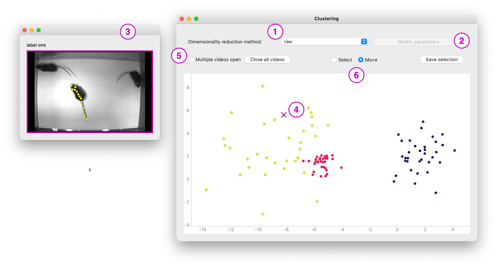
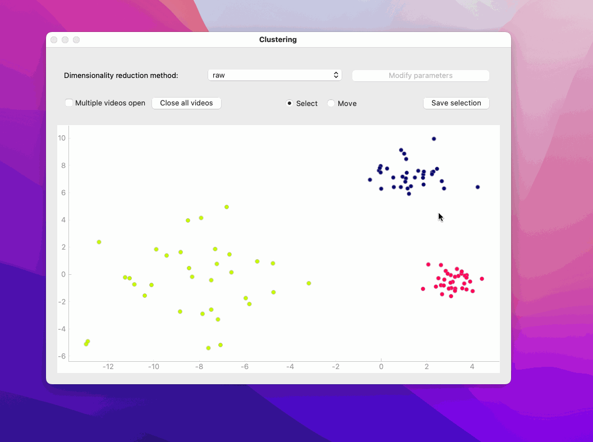

## User guide 

To start using the clustering interface, go to the `classic_annotation` directory and 
run these commands in your terminal.
```bash
conda activate AnnotationGUI
python cluster.py --data_file /path/to/data_file --video_files /path/to/video1 --video_files /path/to/video2 --dlc_suffix dlc_suffix.h5
```
The *data file* should be a pickled object in the following format: a (frames, data, labels) tuple, where frames is an N-length list of 
(video_id, start, end, animal) tuples for the clips that you are clustering; data is a (N, M)-shape numpy array that contains the features 
of those clips; labels is a (N, 1)-shape numpy array that contains the corresponding labels (-100 stands for no label). The *video id* is the 
video file name without the extension (e.g. the id of `my_cool_video.mkv` is `my_cool_video`). 

You can use the *video files* option as many times as necessary to load all the relevant videos. In case you want to display the deeplabcut
predictions, use the *dlc suffix* option to pass all the possible suffixes to the script. The naming convention for DLC files is `{video_id}{dlc_suffix}`.
So for video `my_cool_video.mkv` and deeplabcut suffix `_DLC_resnet.h5`, the deeplabcut file should be named `my_cool_video_DLC_resnet.h5` 
(located in the same folder 
as the video). 

### Interface

Let's go over some interface elements. 



Every entry in your data file is represented by a dot on the clustering plot. You can choose the method for generating the embedding 
space at **1** and modify the algorithm parameters at **2**. Clicking on a dot will open a corresponding clip in a separate window **3**. 
If you have loaded a DLC file, the animal of interest will be highlighted.
In that window you can also see the label assigned to the clip and a colored frame. The color of the frame matches the color of the cross that appears
instead of the dot on the clustering plot **4**. When you click on another dot, by default this clip will close and another will open but you can change 
this behavior at **5** and open multiple clips in parallel. The plot is interactive. You can zoom in and out and move around with your mouse. 
Alternatively, you can use the mouse to make a selection of the clips and save the selected indices in a pickled file. Hold Shift to add to your selection
and click anywhere on the plot to cancel it.



Use **6** to switch between those modes.
