## User guide 

To start using the annotator you just need to go to the `classic_annotation` directory and 
run these commands in your terminal.
```bash
conda activate AnnotationGUI
python annotator.py
```
The app will prompt you to open the video you are going to annotate and (optionally) a DLC output file or an existing annotation file. Note that you can open multiple videos. In that case you will be asked whether you want to open them sequentially or in multiview mode.

Alternatively, you can set the video and/or the output paths in the 
terminal. In that case the file dialogs will not open. 
```bash
python annotator.py --video path/to/video1.mp4 --video path/to/video2.mkv --config_file path/to/config.yaml --labels_file path/to/annotation_file.pickle --multiview
```
You can also configure advanced settings in the config file (`config.yaml` by default). Among other things, you can use it to set:
- the number of individuals if keypoint and annotation files are not available,
- a suffix to automatically determine the output and the detection file paths from the video filename,
- a default list of labels (if it is particularly long you can also opt to pick only the necessary labels from the saved list before each annotation).

You can modify the config file through the settings window. It will open by default the first time you run the interface and you can always go 
back by adding an `-s` / `--open_settings` option when you run the app or pressing 'Settings' in the menu bar when it's already open.

After you start the app it might take up to a couple of minutes for the program to load if the video file is large.
When it does you will be prompted to enter the labels you want to use.
The right column is the shortcut that you can use to annotate that label while watching the video.
It is automatically defined as the first letter of the label name unless that is already reserved, but you can always change it.
You can come back to this dialogue later, even after you start the annotation, so it's okay if you don't enter everything
(or don't enter anything at all) now. 

If you provide a list of labels in the settings, the same dialog will open with pre-loaded categories for fine-tuning.
When you're done with entering the labels, press OK. That should take you to the main window. 

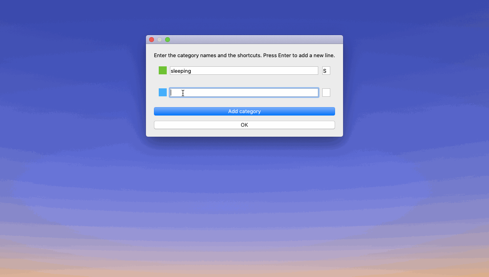

Let's go over the main elements here.


1. **Video canvas**  
Drag and zoom are supported.
If multiple animals are displayed and their keypoints have been uploaded, the animal that is being annotated is the one
with the colored keypoint markers.

2. **Action bar**  
This bar zooms in on the frames closest to the one currently displayed. The thick gray line shows
where you are at the moment. As soon as you start the annotation the labels will be displayed here. If an annotated clip is too short, the label will not
be displayed on the bar. However, you can always see it in the status bar when you hover over an action.
You can mark actions as ambiguous (eigher manually in the **Ambiguous** mode or during shortcut annotation, more on both opttions
in the corresponding sections). In that case the actions will be transparent on the action bar (like jumping in this
example).
Also, clicking anywhere on the bar will take you to the corresponding frame.  

3. **Global bar**  
Here you can see where you are in respect to the entire video and how much of it is currently in the working memory of your machine (blue color). The counter on the right displays the index of the current frame and the total number of frames in the video.
This bar is also clickable, but keep in mind that after clicking outside the blue zone you may need to wait for the video to load.

4. **Status bar**  
The status bar displays contextual prompts.  

5. **Speed sliders**  
You can use the video speed slider to adjust the speed of video playback. When keypoints are provided, displaying them might limit the speed. 
In order to avoid that you can adjust the speed of detection update. Setting it to zero will stop keypoint display altogether.

6. **Individuals menu**  
Pick the animal you want to annotate. You can also use shortcuts (numbers from 0 to 9).

7. **Labels menu**  
The labels and the shortcuts are displayed here. If you want to add a new action manually, you need to select the label for it in this menu.
Use the 'Labels' menu to modify it. If you are using nested annotation, you can choose a category by double-clicking it and go back to 
the categories list by pressing `Esc` or pushing the 'Go back to categories' button.

8. **Mode toolbar**  
Here you can see which of the manual modes is active right now. More on them in the manual annotation section. You can switch between the modes by 
pushing the corresponding button here or in the 'Manual' menu or by pressing a shortcut (see a cheatsheet in the 'Manual' menu). Note that the status bar 
always displays the relevant hints for any mode. The leftmost button on the toolbar starts and pauses the video. You can drag and drop the whole panel to organize the workspace the way you like.

9. **Playlist navigation**  
If you open multiple videos in sequential mode or use label search you will also see these buttons that allow you to move between videos or clips. Your annotation will be saved automatically when you move to a different video.

10. **Menu bar**  
You can find some additional modes and settings in the menu bar. Read on to find out more on some of them. Note that you can also access the settings 
window from here.

### Shortcut annotation
You can start the video by pressing spacebar or the 'Play/Stop' button in the toolbar.
Alternatively, you can browse frame-by-frame by pressing the arrow buttons on your keyboard. If you press one of the shortcuts before
browsing the video in one of these ways everything you see is automatically annotated with the corresponding label until you press the shortcut again.
Multiple shortcuts can be active at the same time.

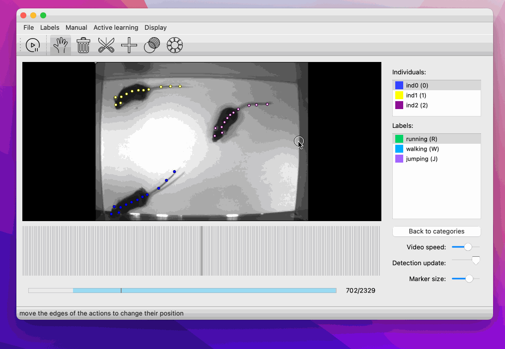

#### Nested annotation
In case you are working with a long structured list of labels, it might be more convenient to use **nested annotation**.
To do that just check that box in the 'Load from list' dialog you will see when the program loads.

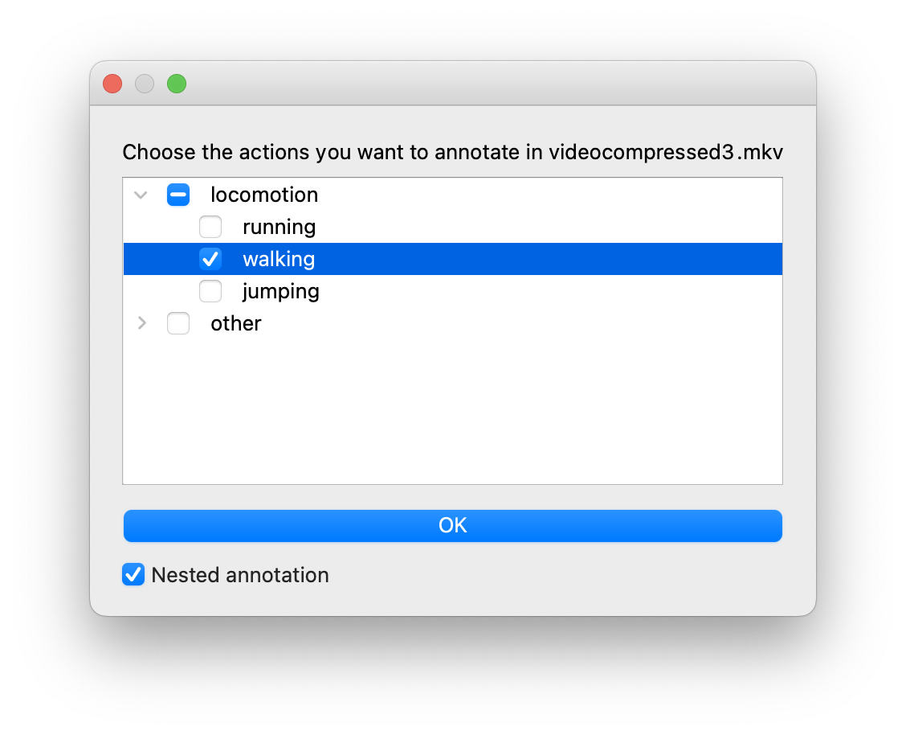

In this mode you can start by annotating a category and specify the label later (either with a shortcut -- the 
right menu will open automatically -- or manually in the **Assign** mode). You can open one of the categories by double-clicking it and go back to the category menu by pressing `Esc`.
You can switch between normal and nested annotation whenever you want: just open the 'Load from labels' menu and check/uncheck the box!

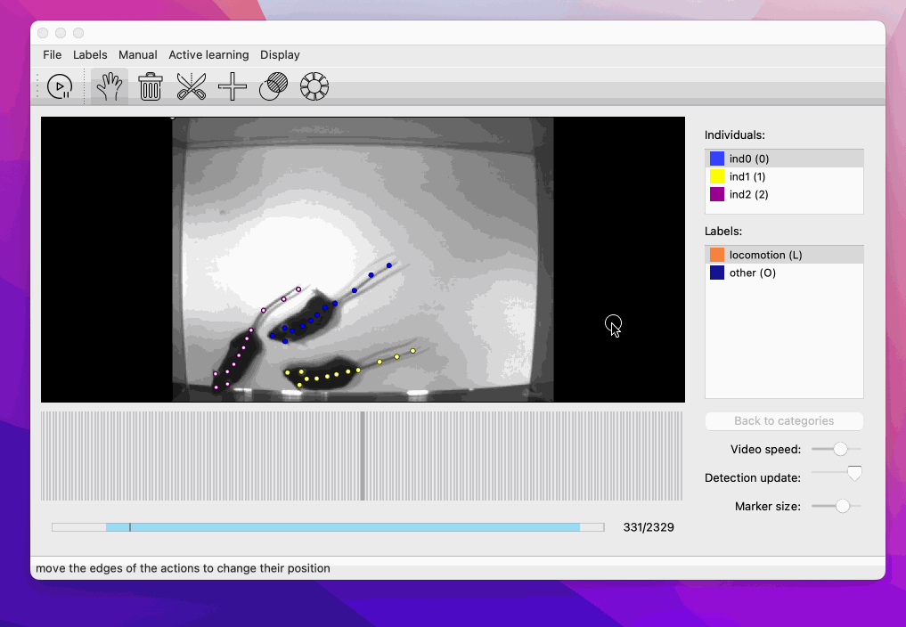

You can also just leave the category as the label, without specifying anything. Press Esc to go back to the categories menu and use the same shortcut to stop the annotation.

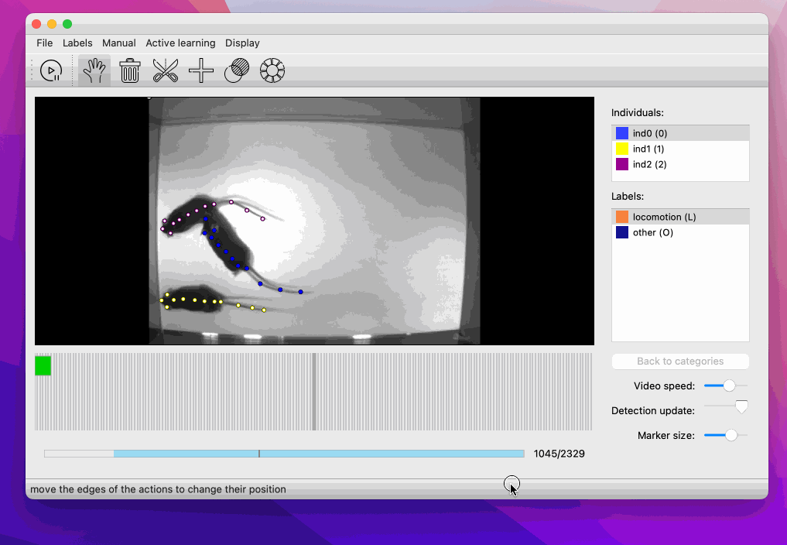

#### Stop shortcut
In addition to pressing the specific label shortcut (like 'L' for leaping), you can also stop annotating a label using the **Stop mode**.
Just press '-' to enter it. One of the labels you are currently annotating will be highlighted. If you press Enter it will be stopped,
'-' will move the selection to the next label and Escape will take you out of this mode. This might be useful if you have 
multiple shortcut menus, like in nested annotation.

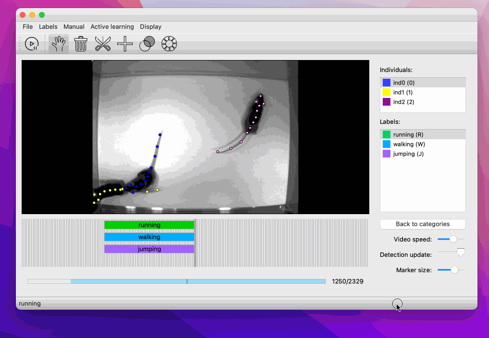

#### Ambiguity shortcut
You can also mark the labels you are annotating as ambiguous using the same mechanics, but with the '=' key.
Pressing '=' will get you to the **Ambiguous mode**, Escape will take you back, '=' navigates through labels and Enter 
changes their ambiguity status. If it was certain it will become ambiguous and vice versa.

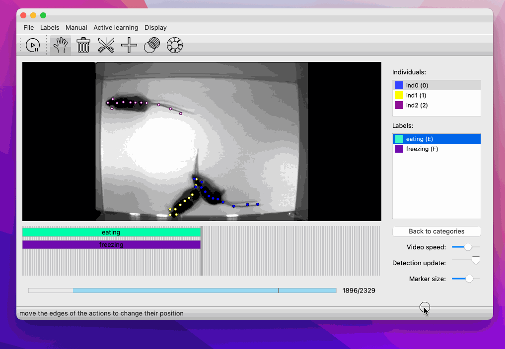

Note that the status bar always displays prompts in case you forget those shortcuts!

### Manual annotation
If you want to add an action manually, just select it in the categories menu, check that the mode is **New** (double-click an action / select the plus icon / press `Ctrl + N`) and
click and drag on the action bar.  

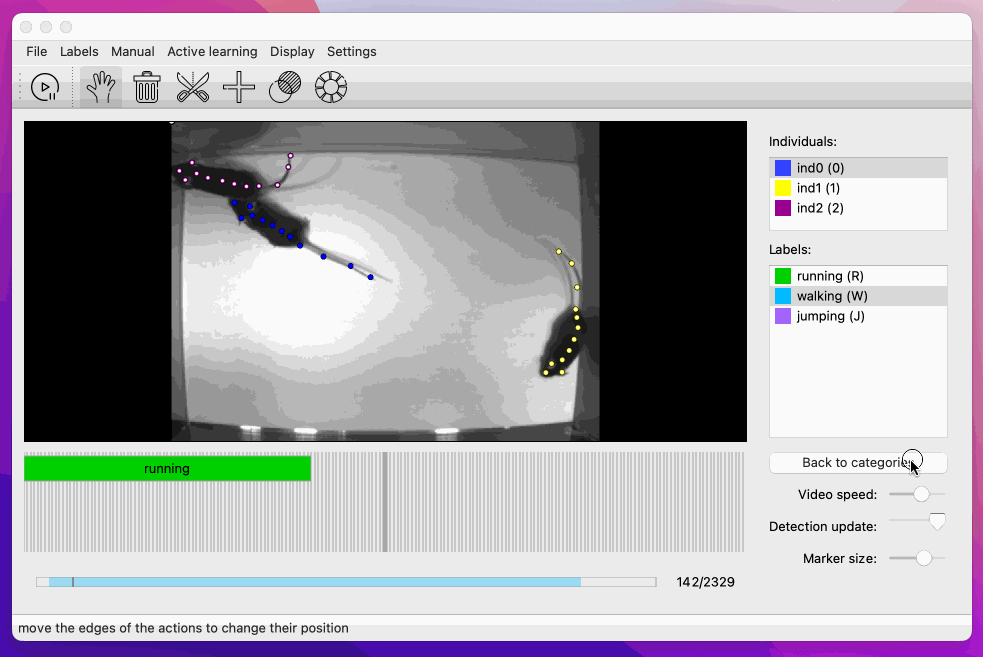  

You can always modify all actions by clicking and dragging the edges in the **Move** mode.  

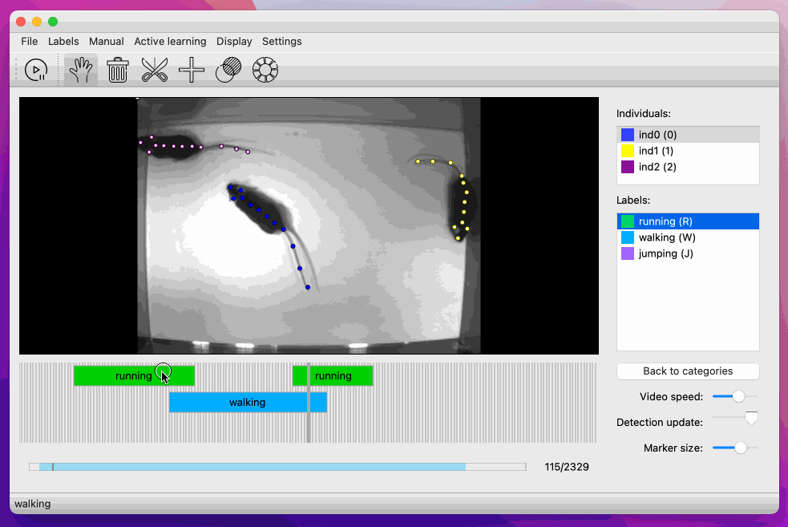  

Clicking an action in the **Remove** mode (select the trash bin icon / press `Cmd + R`) deletes it.  

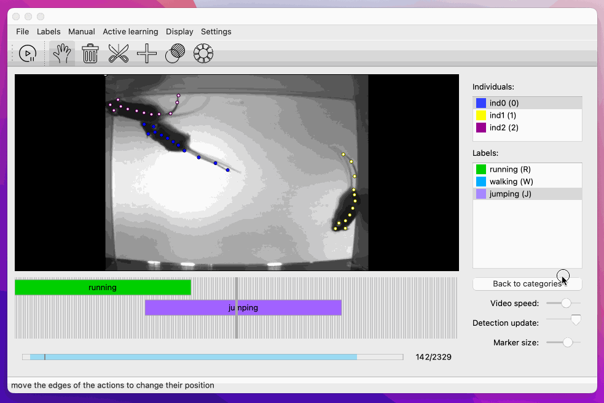

Clicking an action in the **Cut** mode (select the scissors icon / press `Cmd + C`) splits it in two.


Clicking an action in the **Ambiguous** mode (select the transparency icon / press `Cmd + B`) changes its ambiguity.


Clicking an action in the **Assign** mode (select the label icon / press `Cmd + A`) changes its label to the one you choose in the label menu.


### Display modes
There are a couple of display options you can configure. 

Press 'Bodypart colors' to color the keypoints according to their bodypart name (the outline will still be colored according to the individual). 


Add skeleton edges in 'Display' settings (use the bodypart names from the DLC files) and choose 'Skeleton' in the 'Display' menu to start or stop displaying them.


You can also check which bodypart each keypoint represents by pressing it and checking the status bar.


### Correcting pose estimation errors
You can choose 'Save correction...' in the 'File' menu to enter the pose estimation correction mode. Then you can simply click and drag the points that are misplaced. The bodypart name will be displayed at the status bar when you click a point. When you are done, click the 'Save correction' button to finish. If you are working with a video named `/folder/VIDEO.mp4`, the new positions will be saved at `/folder/VIDEO_correction.pickle`. 

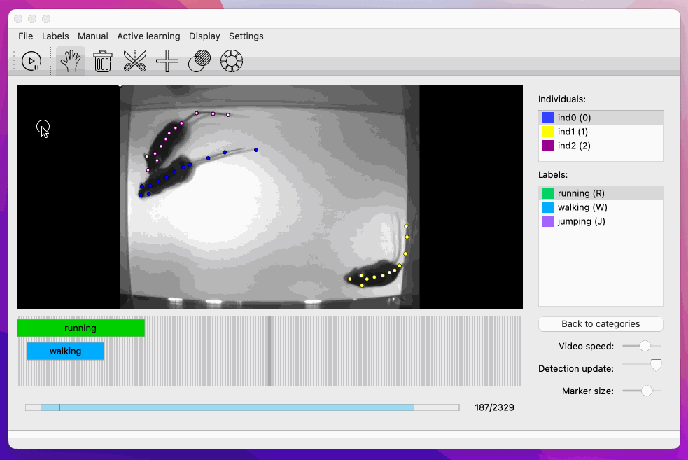

### Search
If you want to get an overview of your annotation, you can use the 'Start label search' (or 'Start unlabeled search') option in the 'Active learning' menu. It will go over all the clips
in this video file that you have annotated with a specific label. If you have loaded a keypoint file, the individual that was annotated with this label will be highlighted and all others will be grey. Press 'Next' and 'Previous' buttons on the control panel to navigate through the clips 
and select 'Start/Stop active learning' in the 'Active learning' menu to go back to the normal annotation mode. 

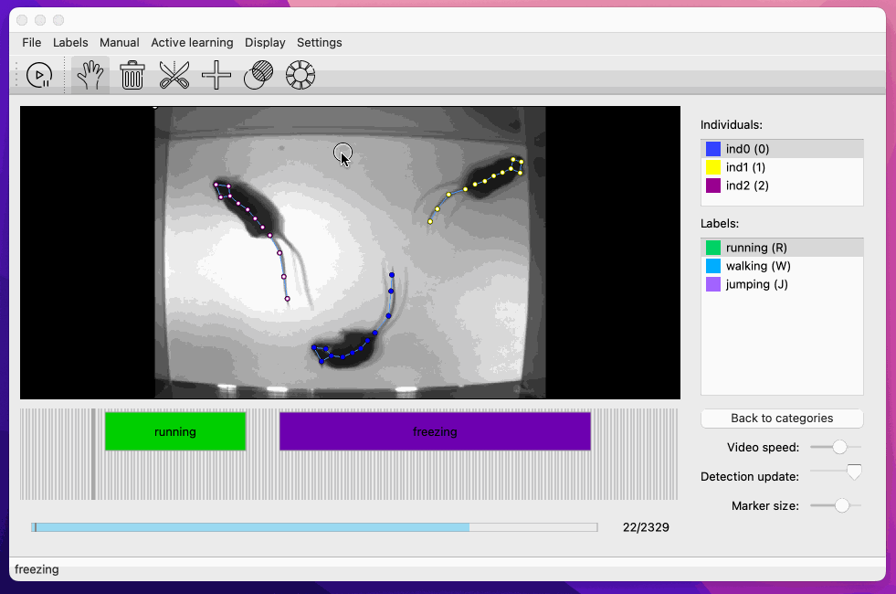

### Saving
The program should run smoothly, but please don't forget to save your results regularly by selecting the 'Save' action in the 'File' menu or pressing `Ctrl + S`, just in case.

### File formats
#### Videos:
The app accepts videos in all commonly used formats.

#### Keypoint files:
The deeplabcut output files can be either tracklets (in .pickle format) or tracks (in .h5 format). You can also load keypoint sequences in the format of the [MABE21](https://www.aicrowd.com/challenges/multi-agent-behavior-representation-modeling-measurement-and-applications/problems/mabe-task-1-classical-classification#dataset) challenge (in that case set data format to calms21 in the general settings).

#### 3D points:
You can also use the interface to open 3d keypoint files as a separate view. To do that, set the 3d suffix in the file settings. If the video you are opening is at `/folder/VIDEO.mp4`, and the 3d suffix is set to `_3d.npy`, the app will expect the 3d files to be at `/folder/VIDEO_3d.npy`. The files should be `numpy` arrays saved in .npy format with shape `(#frames, #keypoints, 3)`. The names of the corresponding bodyparts can be specified in the 
display settings.

#### Calibration:
If you are loading a 3D pose file, you can also display reprojections on other views if a path to a calibration folder is provided in the file settings. The calibration folder is assumed to contain multiple .npy files containing information for different views:
```
calibration_folder
├── camera_aa_calibration.npy
└── camera_ab_caliration.npy
```
In this case the settings from the `camera_aa_calibration.npy` file will be applied to videos that have filenames starting with `aa-` and the settings from the `camera_ab_calibration.npy` file to videos that have filenames starting with `ab-`. Each of the .npy files should contain a dictionary with the following keys: `"r"` with the rotation matrix, `"t"` with the translation vector, `"Intrinsic"` with the intrinsic parameter matrix, `"dist_coeff"` with the distortion coefficients. The format of all parameters should be as specified in [`cv2.projectPoints'`](https://docs.opencv.org/2.4/modules/calib3d/doc/camera_calibration_and_3d_reconstruction.html?highlight=calib#void%20projectPoints(InputArray%20objectPoints,%20InputArray%20rvec,%20InputArray%20tvec,%20InputArray%20cameraMatrix,%20InputArray%20distCoeffs,%20OutputArray%20imagePoints,%20OutputArray%20jacobian,%20double%20aspectRatio)).

#### Annotation:
Your annotation will be saved as pickled files. They can be opened with this python code.
```python
import pickle

with open("/path/to/annotation.pickle", "rb") as f:
  data = pickle.load(f)
 
 metadata = data[0]
 individual_list = data[1]
 label_list = data[2]
 annotation = data[3]
 ```
 
To look up the annotation for individual `"ind0"`, for instance, you can then run the following.
```python
ind_annotation = annotation[individual_list.index("ind0")]
for label_index, label in enumerate(label_list):
  for start, end, ambiguity in ind_annotation[label_index]:
    print(f'from {start} to {end} frame: {label} label with ambiguity {ambiguity}')
```

The ambiguity of an interval will be 1 if you marked it as ambiguous (transparent) and 0 if you didn't.

### Splitting large files
The program works best with shorter, smaller files. In case you want to cut your larger video and skeleton files into several pieces, you can use the 
`split.py` script. Just open the classic_annotation folder in your terminal and run the following:
```bash
python split.py --file path/to/video --split-size S --downsample N --fps F --skeleton-file /path/to/DLC
```
Here 'S' encodes the size of each piece in seconds, `downsample` lets you only keep every `N`th frame (useful in case of large fps) and `F` is the input video framerate. The `skeleton-file` parameter is optional.

Back to main [readme](../README.md)
